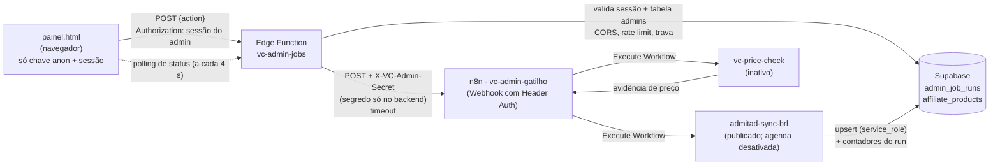

# Painel · "Pesquisar novas ofertas" e "Verificar preço"

## Arquitetura



- O navegador conhece **apenas** o nome da função (`vc-admin-jobs`). URL do webhook, segredo do header, URL do feed e `service_role` ficam no backend.
- `admin_job_runs` registra cada solicitação. O índice único parcial garante **no máximo uma busca pendente ou em andamento**, mesmo com cliques simultâneos.
- O trigger `protect_admin_decisions` garante, no banco, que gravações da automação (`service_role`):
  - criem produtos novos com `active=false`;
  - nunca alterem `active`, `display_title`, `category` ou `sort_order` de produtos existentes.

## Ações da função

| Ação | Quem | Faz | Limites |
|---|---|---|---|
| `start_sync` | admin logado | cria o run, chama o n8n (espera só o "aceite") e marca `running` | 1 por vez; intervalo de 10 min; aceite em até 10 s |
| `status` | admin logado | devolve o run sanitizado; marca `timeout` se passar de 15 min | — |
| `check_price` | admin logado | verifica **uma** oferta; grava preço só com evidência válida | 60 s por oferta; 20 por hora por admin; resposta em até 25 s |

Respostas nunca incluem títulos, `raw_payload`, links, headers ou tokens. Os logs registram apenas evento, `run_id` e código.

### Fonte de preço (o que é possível de verdade)
A fonte oficial conectada é o **feed Admitad "hot products"** (CSV, BRL, só itens em promoção). Ela **não permite consulta por produto**: um preço só pode ser confirmado se o item ainda estiver no feed atual.
- Se o item estiver no feed, a função recebe a evidência (`price`, `old_price`, `currency: "BRL"`, `observed_at`) e atualiza o preço.
- Se não estiver, a resposta é "Não foi possível confirmar o preço". A função registra `price_checked_at` e `price_check_status='unconfirmed'`, e o preço não é alterado.
- Ofertas manuais não têm fonte automática.
- Nada é raspado do AliExpress, e nenhum valor antigo do banco é usado como "confirmação".
- A verificação de **todos** os ativos não foi implementada, porque aguarda autorização.

## Contrato com o n8n

### 1. Workflow `vc-admin-gatilho` (publicado; não tem agendamento)
- **Webhook**: método POST, caminho aleatório, *Authentication: Header Auth* com a credencial `VC Admin Secret` (header `X-VC-Admin-Secret`). *Respond: Using "Respond to Webhook" node*.
- **Switch** em `{{$json.body.mode}}`:
  - `sync`:
    1. **Respond to Webhook** imediatamente com `{"accepted": true, "run_id": "<body.run_id>"}`.
    2. **Execute Workflow** → `admitad-sync-brl` (aguardar conclusão).
    3. **Supabase: Update** em `admin_job_runs` (`id = run_id`), usando a credencial de serviço: `status='completed'`, `finished_at=now`, `found`, `rejected`, `approved`, `saved`.
    4. Em caso de erro: `status='failed'`, `error_code='n8n_error'`.
  - `price_check`:
    1. **Execute Workflow** → `vc-price-check` com `external_id`.
    2. **Respond to Webhook** com:
       - se encontrou: `{"run_id", "external_id", "found": true, "price", "old_price", "currency": "BRL", "source": "admitad_feed", "observed_at": "<ISO>"}`;
       - se não encontrou: `{"run_id", "external_id", "found": false}`.

### 2. Ajustes no `admitad-sync-brl` (publicado, com o Schedule Trigger desligado)
- O nó **Execute Workflow Trigger** é a entrada usada pelo `vc-admin-gatilho`.
- O nó final devolve `run_id` e os 4 contadores: `found`, `rejected`, `approved`, `saved`.
- O upsert não precisa mais cuidar de `active`, `display_title` e `category`, porque o trigger do banco já protege esses campos. Mesmo assim, recomenda-se removê-los do mapeamento de atualização.

### 3. Workflow `vc-price-check` (inativo)
Lê o mesmo feed (a URL do feed fica numa credencial ou variável do n8n, nunca no repositório), procura a linha pelo `external_id` e devolve apenas os campos acima.

## Configuração dos segredos (sem valores)

1. Gere um segredo forte localmente: `openssl rand -hex 32` (não cole o valor em chats, issues ou commits).
2. No n8n: *Credentials → New → Header Auth*
   - Name: `X-VC-Admin-Secret`
   - Value: o segredo gerado.
3. No Supabase (*Edge Functions → Secrets*), ou pela CLI:
   ```
   supabase secrets set VC_ADMIN_N8N_WEBHOOK_URL=<URL de produção do webhook do vc-admin-gatilho>
   supabase secrets set VC_ADMIN_N8N_SECRET=<o mesmo segredo do passo 2>
   supabase secrets set ALLOWED_ORIGINS=https://vitrinecertaa.com.br,https://www.vitrinecertaa.com.br
   ```
   Opcionais: `SYNC_COOLDOWN_MIN` (10), `RUN_TIMEOUT_MIN` (15), `ACK_TIMEOUT_MS` (10000), `PRICE_TIMEOUT_MS` (25000), `PRICE_CHECKS_PER_HOUR` (20), `PRICE_CHECK_PRODUCT_COOLDOWN_S` (60).
   `SUPABASE_URL`, `SUPABASE_ANON_KEY` e `SUPABASE_SERVICE_ROLE_KEY` já são fornecidos pelo Supabase à função.
4. Para testar num preview da Vercel, adicione a URL do preview em `ALLOWED_ORIGINS` só durante o teste.

## Ordem de implantação
1. Revisar e aplicar, nesta ordem e com backup antes:
   - `supabase/migrations/20260924120000_admin_jobs.sql`;
   - `supabase/migrations/20260924121000_admin_panel_security.sql`.
   A segunda migração remove os privilégios amplos encontrados na auditoria de RLS,
   consolida as policies duplicadas e limita o painel às colunas autorizadas.
2. Configurar e publicar o n8n (itens 1–3 acima), mantendo o Schedule Trigger do `admitad-sync-brl` desativado.
3. Definir os segredos e publicar a função: `supabase functions deploy vc-admin-jobs` (mantendo a verificação de JWT padrão).
4. Mesclar o PR do painel.
5. **Um** teste controlado, com autorização: clicar uma vez em "Pesquisar novas ofertas" e conferir o resumo e se os produtos novos ficaram "Em revisão".

## Evidência do teste controlado de 24/09/2026

- Execução `vc-admin-gatilho` #29 e subworkflow #30 concluíram com sucesso.
- Contadores observados: `found=6`, `rejected=5`, `approved=1`, `saved=1`.
- O catálogo passou de 26 para 27 produtos; permaneceu com 2 ativos e passou a 25 inativos.
- A oferta criada ficou inativa, com estado **Em revisão**.
- A ausência da etapa final deixou o run original em `running`; a correção posterior adicionou a devolução dos contadores e o `PATCH` final de `admin_job_runs`. Ela foi validada por inspeção da configuração, sem executar nova sincronização real.

## Reversão
- Painel: reverter o PR, ou fazer "Promote" do deploy anterior na Vercel.
- Função: `supabase functions delete vc-admin-jobs`, ou remover `VC_ADMIN_N8N_WEBHOOK_URL` (ela passa a responder `not_configured`).
- n8n: desativar `vc-admin-gatilho`.
- Banco: bloco "ROLLBACK" no fim da migração.

## Testes locais
- `deno test --allow-read supabase/functions/vc-admin-jobs/handler.test.ts`: 24 testes da função (auth, CORS, clique duplo, timeout, erro e resposta inválida do n8n, evidência de preço, rate limit, vazamento de segredos).
- `supabase/tests/admin_jobs_test.sql`: 17 testes da migração num Postgres descartável (produto novo inativo, ativo continua ativo, `display_title` preservado, trava única, RLS).
- `supabase/tests/admin_panel_security_test.sql`: privilégios mínimos, colunas editáveis, policies canônicas, constraints e compatibilidade do cadastro manual. Executar somente em Postgres local/descartável.
